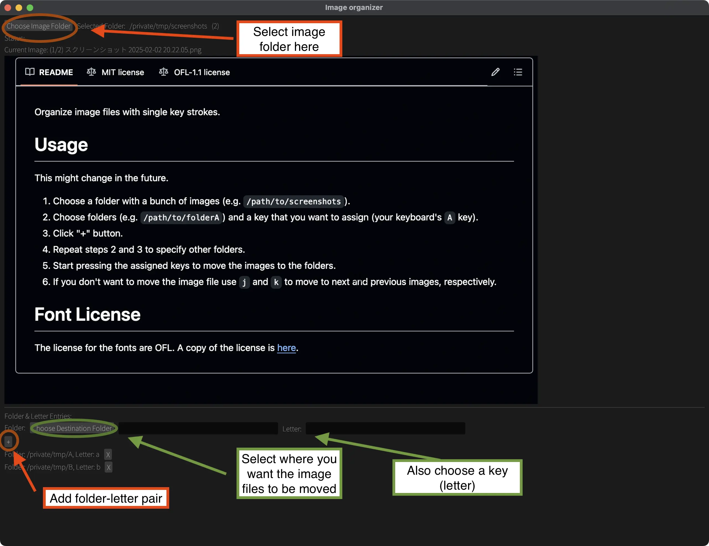

Organize image files with single key strokes.

# Usage
This might change in the future.

1. Choose a folder with a bunch of images (e.g. `/path/to/screenshots`).
2. Choose folders (e.g. `/path/to/folderA`) and a key that you want to assign (your keyboard's `A` key).
3. Click "+" button.
4. Repeat steps 2 and 3 to specify other folders.
5. Start pressing the assigned keys to move the images to the folders.

## Navigation
- Use `j` and `k` to move to next and previous images, respectively.
- `Ctrl + Z` to undo.

# Why I made this
I had a bunch of unorganized screenshots and wanted to move them into different
folders. But dragging and dropping each one was too painful. I wanted a tool
where I can press a single key to sort images into folders.

# Font License
The license for the fonts are OFL. A copy of the license is [here](OFL.txt).
